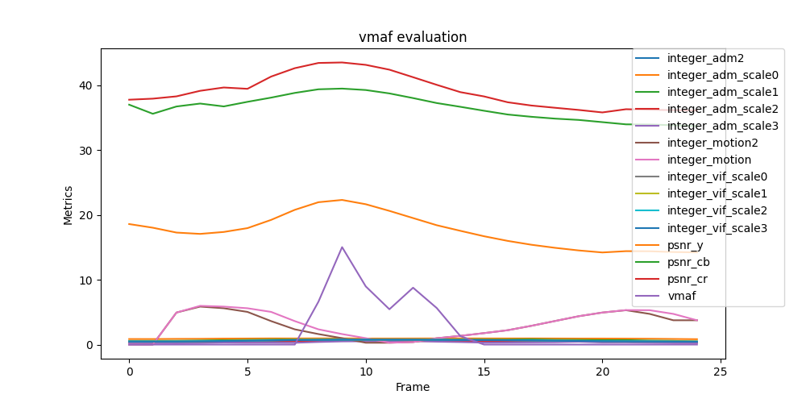

# 计算机网络实验班 Lab2 实验报告

匡宇轩 曹思诺 潘重阳

源代码地址：https://github.com/yxKryptonite/ComNet/tree/lab2

## 1. 简介

我们在使用 Ubuntu 20.04/18.04 的 Linux 虚拟机上，用 AlphaRTC 完成了视频 

1. 从本机传输到本机 
2. 在两个不同 IP 的虚拟机之间传输

我们计算了传输过程中的吞吐率和丢包率，用 vmaf 计算了传输后视频的 vmaf 分数以及其他指标，并将结果可视化，然后对实验结果进行细致的分析。

我们还设计了多组实验来验证视频长度、是否后处理、是否同一IP等因素对视频传输质量的影响。

## 2. 依赖安装

### 2.1 安装 AlphaRTC

根据 AlphaRTC 的文档，其实只需要拉取 AlphaRTC 官方镜像即可。但由于理解错误，我们还额外进行了编译，在编译过程中遇到了许多困难，但我们最终还是解决了它们并成功编译。

#### 2.1.1 编译中遇到的困难

在编译的过程中，我们发现即使已经打开了VPN，仍然会出现 `unable to access 'https://chromium.googlesource.com/chromium/tools/depot_tools.git'`  的报错。我们推测，导致这个错误的原因是，在 docker 的内部没有走代理流量。于是，我们手动更改了 `Dockerfile.compile` 文件，在其中手动设置了代理的环境变量，才成功解决此问题 。

此外，AlphaRTC 的某个依赖 depot_tools 在某个版本更新之后就去掉了 ninja 包管理器的安装，但 AlphaRTC 需要 ninja 来安装其他的依赖，所以我们更改了 `Dockerfile.compile` ，手动安装 ninja。

因此，我们 fork 了原 AlphaRTC 仓库并加以修改，最终我们使用的是我们自己的 [AlphaRTC 仓库](https://github.com/yxKryptonite/AlphaRTC)，同时，我们也向原仓库提交了 [Pull Request](https://github.com/OpenNetLab/AlphaRTC/pull/90) 修复这些 bug。

#### 2.1.2 具体步骤

最详细的步骤、文档以及代码的使用，请参看我们仓库的[README](https://github.com/yxKryptonite/ComNet/blob/lab2/README.md)。以下为我们实验步骤的中文文字版本：

1. 拉取 AlphaRTC 的 docker 镜像

    ```bash
    docker pull opennetlab.azurecr.io/alphartc
    docker image tag opennetlab.azurecr.io/alphartc alphartc
    ```

2. 克隆 AlphaRTC 和 vmaf，这里使用的是为了解决安装时的网络问题而自行修改过的 AlphaRTC 仓库

    ```bash
    cd src
    git clone git@github.com:yxKryptonite/AlphaRTC.git # my version of AlphaRTC
    git clone git@github.com:Netflix/vmaf.git
    ```

3. **(可选)** 编译 AlphaRTC
   1. 修改 `AlphaRTC/dockers/Dockerfile.compile` ，配置代理环境变量，此处 `<your_proxy_port>` 为主机代理端口

      ```bash
      # in `AlphaRTC/dockers/Dockerfile.compile`
      ENV HTTP_PROXY "http://127.0.0.1:<your_proxy_port>"
      ENV HTTPS_PROXY "http://127.0.0.1:<your_proxy_port>"
      ```

    2. 开始编译

        ```bash
        cd AlphaRTC
        make all
        ```

### 2.2 安装 vmaf

安装 vmaf 的过程非常顺利，直接按照官方 repo 的文档操作即可。

具体步骤如下：

1. 安装需要的工具

    ```bash
    python3 -m pip install virtualenv
    python3 -m virtualenv .venv
    source .venv/bin/activate
    pip install meson
    sudo [package-manager] install nasm ninja-build doxygen xxd
    ```

2. 编译 vmaf 

    ```bash
    meson build --buildtype release
    ninja -vC build
    ```

## 3. 视频传输

### 3.1 同一个虚拟机作为发送端和接收端， IP 为 0.0.0.0

#### 3.1.1 实验环境

本实验在 Windows 11 操作系统上的 VMware® Workstation 16 Pro中进行，运行一个Ubuntu 18.04.6 LTS虚拟机。

#### 3.1.2 实验过程

AlphaRTC 在 `examples/peerconnection/serverless/corpus` 目录下提供了单个机器作为发送端和接收端传输视频的示例，本实验在此基础上进行修改，将传输提供的样例视频改为传输我们自己选用的视频 cxk.mp4 ，并修改配置文件，然后进行视频传输。

1. 将 cxk.mp4 文件传到 `corpus/testmedia/` 中
2. 用 ffmpeg 将 mp4 文件转化为 yuv 文件

    ```bash
    ffmpeg -i cxk.mp4 cxk.yuv
    ```

3. 修改配置文件 `receiver_pyinfer.json` 和 `sender_pyinfer.json` ，保持 IP 地址为 0.0.0.0 和目标/监听端口为 8000 不变，修改 `width`, `height`, `fps` 和 `autoclose` 字段为被传输视频的宽、高、帧率、时长，修改 `file_path` 字段为相应的被传文件/输出文件路径。

   本实验中，以上的字段分别为：`width = 1280, height = 720, fps = 25, autoclose = 60`, 输入视频的 `file_path = testmedia/cxk.yuv`, 输出视频的 `file_path = outvideo.yuv` 

4. 启动容器，并运行传输进程（这一步在 `src/AlphaRTC` 目录下进行），在这一步我们可以同时获得 `webrtc.log` 日志文件以便于之后分析

    ```bash
    docker run -d --rm -v `pwd`/examples/peerconnection/serverless/corpus:/app -w /app --name alphartc alphartc peerconnection_serverless receiver_pyinfer.json
    docker exec alphartc peerconnection_serverless sender_pyinfer.json
    ```

5. **(可选)** 将传输得到的视频转化回 mp4 格式，查看传输效果。

    ```bash
    ffmpeg -i outvideo.yuv outvideo.mp4
    ```

### 3.2 不同 IP 的两台虚拟机作为发送端和接收端

#### 3.2.1 实验环境

本实验在 Windows 11 操作系统上的 VMware® Workstation 16 Pro中进行，同时运行两个Ubuntu 18.04.6 LTS虚拟机。这两台虚拟机加载的镜像是从已成功进行单主机实验的虚拟机镜像中复制而来的。两台虚拟机在 NAT 模式下运行。在 NAT 模式下，虚拟 NAT 设备与虚拟 DHCP 服务器一起连接在虚拟交换机上，两台虚拟机共享同一网段。

#### 3.2.2 实验过程

1. 我们首先查看了两台虚拟机分配到的IP地址，实验时接收者（receiver）的 IP 为 192.168.160.140，发送者（sender）的 IP 为 192.168.160.139。

2. 接着，我们配置了发送者的 config json，修改了目标 IP ，并将目标端口设置为8000。同时，我们也配置了接收者的config json，设置其监听0.0.0.0, 8000端口。

3. 在完成了以上步骤后，我们启动了两台虚拟机的container：

    ```bash
    sudo docker run --privileged --network=host -d --rm -v `pwd`/examples/peerconnection/serverless/corpus:/app -w /app --name alphartc alphartc /bin/bash -c "while true; do sleep 1000; done"
    ```

4. 最后，我们分别启动了两台虚拟机的传输进程：
   
     - receiver:

       ```bash
       sudo docker exec --privileged alphartc peerconnection_serverless receiver_pyinfer.json
       ```

     - ​sender:

       ```bash
       sudo docker exec --privileged alphartc peerconnection_serverless sender_pyinfer.json
       ```

5. 传输结束后，收集源视频和传输后视频，receiver 和 sender 的 config 文件以及 receiver 和 sender 的传输日志进行分析。


## 4. 丢包率与吞吐量计算

我们利用 `webrtc.log` 日志文件来计算传输过程的丢包率和吞吐量。

### 4.1 计算公式

在 `webrtc.log` 文件中，在每一个 packet 的日志中，都有 `arrivalTimeMs`, `payloadSize` 和 `lossRates` 这三个字段，分别表示每个包的到达时间戳（单位为毫秒）、荷载大小以及丢包率。相邻两个包的 `arrivalTimeMs` 作差得到 `delta_arrivalTimeMs` 即可以视作一个包的传输时间。将 `delta_arrivalTimeMs`, `payloadSize` 和  `lossRates` 累加的就得到 `total_time_ms`,  `total_payload` 和 `total_loss`, 再用 `total_count` 记录包的个数。

然后用 `throughtput = total_payload / total_time_ms * 1000 ` 计算吞吐量（单位 bps），

用 `loss = total_loss / total_count` 计算丢包率。

### 4.2 计算结果

+ 对于单虚拟机传输，我们做了两组测试：

  + 实验一：单机器，传输时长为 1 秒的视频

    吞吐量：1533 bps

    丢包率：0

  + 实验二：单机器，传输时长为 60 秒的视频

    吞吐量：99 bps

    丢包率：0

+ 对于双虚拟机间的传输，我们做了一组测试：

  + 实验三：双机器，传输时长为 60 秒的视频

    吞吐量：1183 bps

    丢包率：0

### 4.3 结果分析

#### 4.3.1 吞吐量分析

理论上分析，如果我们传输的是一个 60s 的视频对应的 yuv 文件，其大小大约为 2GB ，花费的时间大约 20 秒。那么吞吐量的量级应该为 100 Mbps 。然而，我们实际计算出的吞吐量比这个量级小了很多。

我们对传输时长为 1s 的视频得到的数据进行了具体的分析，发现如下现象：

1. 计算出的传输数据总量大小基本正确。

​   时长为 1s 的视频对应的 yuv 文件的理论大小约为 30MB 。我们查看了计算出的 `total_payload` ，发现其大小约为 31MB ，量级基本相符，说明问题不出在数据总量的计算上。

2. 计算出的传输数据时长远大于实际数据。

​   我们查看了计算出的 `total_time_ms` ，发现其换算成秒后居然可以达到约 20000 秒，这显然是不可能的。进一步考察日志数据中的异常值，发现某些相邻两个包之间的时间间隔非常大，其中最大的一个时间间隔就达到了约 13000 秒。这种巨大的时间间隔往往出现在日志文件中两个段落的边界处。

以上分析说明，计算出的吞吐量非常小很可能是因为时间计算错误导致的，这可能是因为日志文件中的时间戳记录遵循着某些有一些我们不知道的独特方法，也说不定只有其中的一部分时间数据是有效的，在这里我们不能给出准确的原因定位。

#### 4.3.2 丢包率分析

可以看到，在我们进行的所有实验中，丢包率都是 0 ，多么令人惊喜！然而，这也是合理的。

对于单个虚拟机作为发送端和接收端的情境，因为包是从本机传到本机，没有进入网络中，所以不发生丢包很正常。

对于同一主机上两个虚拟机分别作为发送端和接收端的情境，因为我们使用了 NAT 模式，两台虚拟机连接在同一个虚拟交换机上，所以包自始至终都没有离开物理主机，因而不发生丢包也是正常的。

## 5. vmaf 值计算

### 5.1 计算方法

我们将原视频（yuv格式）和传输之后得到的视频进行 vmaf 值计算，我们使用的具体命令是：

```bash
vmaf \
    --reference <inputfilename.yuv> \
    --distorted <outputfilename.yuv> \
    --width <width> --height <height> \
    --pixel_format <usually 420> --bitdepth <usually 8> \
    --model version=vmaf_v0.6.1 \
    --feature psnr \ # you can add other features here
    --json --output vmaf.json
```

我们选用了 psnr 作为额外的 metric，json 作为输出格式，得到了输出文件 `vmaf.json`。

### 5.2 结果分析

#### 5.2.1 同一IP：1s视频

我们截取 cxk.mp4 的第一秒，在同一IP下进行传输。运行vmaf程序后，得到vmaf分数为 **2.07**，并将结果可视化如下：



可以看到，大多数帧，vmaf值都为0，并且峰值也不超过20，这说明传输后的视频用vmaf来衡量，效果非常差。但是可以观察到 psnr_cb 和 psnr_cr 的值都接近40，这说明从视频单帧的质量来看，损失并不严重。

#### 5.2.2 同一IP：完整视频

我们将接近60秒的 cxk.mp4 完整视频在同一IP下进行传输。运行vmaf程序后，得到vmaf分数为 **4.80**，并将结果可视化如下：


同上，许多帧的vmaf值都为0，但是峰值超过了50，且在前半部分vmaf值基本在10-20之间波动，可见传输后的视频的质量有一定提升，但由于许多帧的vmaf值为0，总体分数依然较低。同样的，psnr指标并不低，说明单帧的质量并没有损失太多。

#### 5.2.3 同一IP：完整视频 + 后处理

我们在观察之前两个实验传输后得到的视频后发现，传输视频和原视频发生了偏移，即原视频的开头部分移到了目标视频的结尾部分，这导致两个视频大多数帧并不能很好对应。如下图所示：两个视频的第一帧，从蔡徐坤的鞠躬看出，输出明显提前于输入。


同时播放2个视频，可以看到，输出视频中，蔡徐坤在飞吻之后，开始鞠躬，也就是说，输出视频将最开头的部分移到了最后，导致视频的对应关系错乱。


因此我们对传输后的视频进行了后处理，即将两个视频转为图片帧序列，首先对输出视频的结尾帧序列进行增添或删除，目的是将2个视频的总帧数对齐，然后观察具体在哪一帧发生了偏移，接着将输出视频帧的最后部分移动到开头部分，最后将输出视频帧转回视频。这样，我们就得到了一个和原视频帧对应关系正确的输出视频。

将后处理后的视频与原视频进行vmaf计算，vmaf 分数有了较大提升，达到了惊人的 **85.17**！我们将结果可视化如下：


可以看到，除了开头的波动，其他帧的分数都基本在90分以上，并且psnr也有了很大幅度的提升，这说明后处理可以有效提升输出视频质量。

#### 5.2.4 不同IP：完整视频 + 后处理

我们用第 3.2 节的步骤进行不同IP下 cxk.mp4 完整视频的传输，然后进行后处理。在后处理的过程中，我们发现由于不同IP传输的损失问题，输出视频丢失了不少帧，视频长度减少了将近5秒，这说明不同IP下的传输效果并不令人满意。

将后处理后的视频与原视频进行vmaf计算，得到 vmaf 分数仅有 **0.80**，并将结果可视化如下：


我们推测，由于不同IP下视频传输的损失问题，视频在中间部分也丢失了不少帧，导致整个视频的帧对应关系十分混乱，并且无法通过后处理的方式解决，因此尽管vmaf峰值达到了50以上，但由于太多帧的vmaf值为0，总体分数依然很低。

此外，我们还发现，相对于同一IP下的传输，不同IP下的传输，三个 psnr 的值都有了很大幅度的下降，这说明不同IP下的传输，单帧的质量损失更加严重，这从输出视频画面更加模糊、色调发生偏移可以直观的看出，如下图所示：


#### 5.2.5 不同IP：完整视频 + 后处理 + 局部分析

我们假设，虽然不同IP下损失严重，但在一个很小的局部，损失会大大减小，于是我们将后处理视频的最后一秒与原视频的最后一秒截取下来，如下图所示：


然后将这两个视频进行vmaf计算，得到 vmaf 分数为 **90.49**，并将结果可视化如下：


可以看到，相对于完整视频和只传输一秒的视频，传输完整视频但只截取一秒的视频质量很高，这说明不同IP下的传输损失问题确实很严重，但在一个很小的局部，损失会大大减小。

## 6. 总结

在这个 lab 中，我们使用了 AlphaRTC 进行同一IP和不同IP下的视频传输，并用vmaf工具进行视频质量的评估。我们设计了多组实验，对视频传输的各个方面进行了分析。

在实验过程中，我们遇到了很多困难，但也学习了许多，例如docker的使用、dockerfile的编写、AlphaRTC, vmaf, ffmpeg等工具的使用、视频传输的原理等等。我们也发现了许多有趣的现象，例如不同IP下的传输损失问题、视频传输的偏移问题、后处理的有效性等等，在这个过程中，我们受益良多。

此外，我们还发现，一个项目在实际部署中，实际上需要克服许多困难，我们也很高兴能为 AlphaRTC 这个开源项目做出自己的贡献！