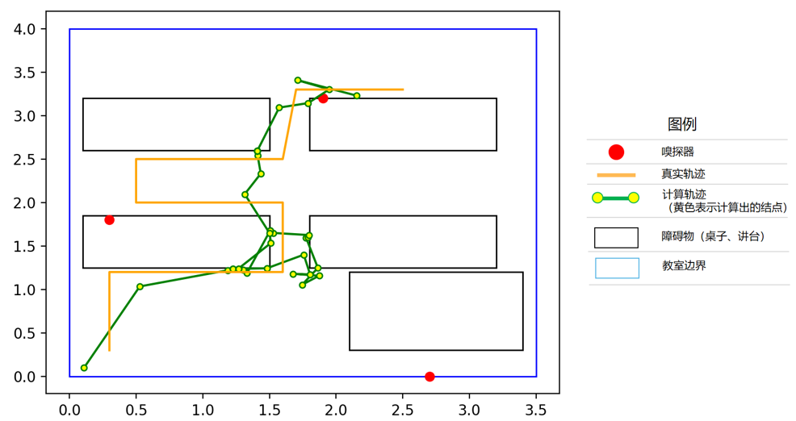
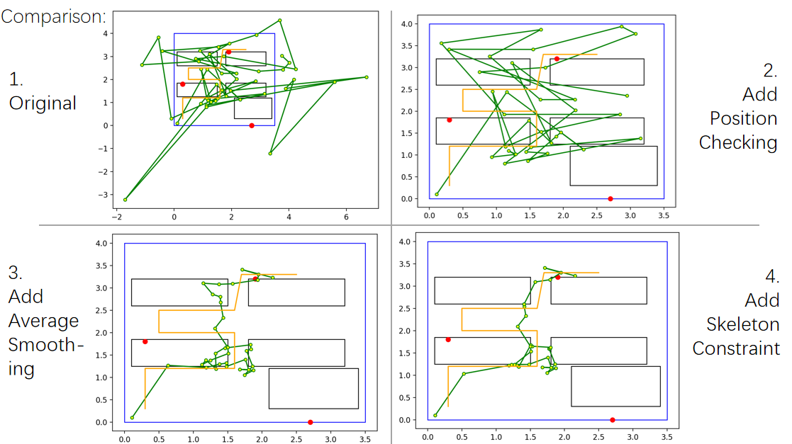

# 计算机网络实验班 Lab1 实验报告

匡宇轩 曹思诺 潘重阳

源代码地址：https://github.com/yxKryptonite/ComNet/tree/lab1

## 1. 简介

我们通过使用WiFi嗅探器成功地实现了室内定位技术的基本应用。4月17日，我们领取了所需的WiFi嗅探器设备。在此之后，我们对WiFi嗅探器的配置、数据上传等功能进行了解，并规划了相关的实地实验方案。于4月21日，我们开展了实地实验，对定位数据进行了测量和收集。实验完成后，我们持续进行算法设计和优化工作，并对实验结果进行可视化展示。实验最后，我们撰写了详细的实验报告以记录整个实验过程。

## 2. 实验方案

### 2.1 实验环境

实验设备：

1. 3台WiFi嗅探器

2. 1台笔记本电脑，作为服务器的宿主机

3. 1台实验用手机，作为被定位对象

4. 1台路由器手机，作为实验用wifi网络的路由器

实验场地：二教514教室，属空间比较狭小的室内环境，家具较多。

实验时间：2023年4月21日下午

### 2.2 实验过程

1. 路由器手机打开共享热点功能，构建实验用wifi网络
2. 将3个WiFi嗅探器分布在室内固定点位，并配置所有三台wifi嗅探器，服务器宿主笔记本电脑连接上实验用wifi网络
3. 测量场地大小、嗅探器位置、障碍物位置等，然后对场地进行坐标建模
4. 运行服务器程序，使服务器能正常接收嗅探器上传数据
5. 实验者手持手机在场地中缓慢移动，确认嗅探器能够正常获取数据并上传服务器
6. 实验过程中，嗅探器持续获取实验手机的信号并将数据包上传至服务器，服务器对数据包字段进行处理，并将处理之后的数据存储在本地数据库中
7. 实验结束后，关闭服务器和嗅探器等设施
8. 后续对储存的数据进行算法处理，对结果进行可视化

## 3. 算法解释

### 3.1 距离估计算法

经过试验，发现嗅探器数据的 `RANGE` 字段具有较大误差，已经到了不能直接使用的地步。于是我们决定使用 `RSSI` 字段来间接计算实验手机与嗅探器的距离。

实验中实际使用的距离估计算法代码如下：

```python
def rssi_to_dist(rssi):
    distance = 10 ** ((-38.5 - float(rssi)) / (10 * 2.9))
    return distance
```

这段代码定义了一个名为 `rssi_to_dist` 的函数。输入参数是 `rssi` 信号强度。函数的主要作用是将 `rssi` 信号强度转换为距离。

公式推导过程如下：

这个算法基于自由空间路径损耗模型（Free Space Path Loss Model），该模型描述了无线电波在自由空间传播过程中能量损失的变化。根据这个模型，接收信号强度（RSSI）与发送端和接收端之间的距离之间存在对数关系。具体来说，距离和 RSSI 之间的关系可以表示为：
$$
distance = 10^{\frac{P_0-RSSI}{10n}}
$$
其中：

* $distance$ 是发送端和接收端之间的距离。
* $P_0$ 是距离为1米时的接收信号强度（参考 $RSSI$ 值）。
* $RSSI$ 是接收到的信号强度。
* $n$ 是环境衰减因子，表示信号衰减的速率。

在给定的算法中，$P_0$ 取值为 -38.5 dBm，$n$ 取值为 2.9。这两个值通常是基于**实际测量和经验**得出的。环境衰减因子 $n$ 的值通常在 2（开放空间）到 4（城市环境和建筑物内部）之间。在这个例子中，我们使用 2.9 作为衰减因子。

### 3.2 三角定位算法

有了嗅探器和实验手机之间的距离，我们便可以使用三角定位算法来计算手机位置。通过至少三个已知位置的嗅探器，可以构建三个圆，圆心分别为嗅探器的位置，半径为实验手机与嗅探器之间的距离。实验手机的位置为这三个圆的交点。实验中使用的三角定位算法代码如下：

```python
def triangulation(p1, p2, p3, r1, r2, r3):
    '''三点定位算法'''
    x1, y1 = p1
    x2, y2 = p2
    x3, y3 = p3

    A = 2 * x2 - 2 * x1
    B = 2 * y2 - 2 * y1
    C = r1 ** 2 - r2 ** 2 - x1 ** 2 + x2 ** 2 - y1 ** 2 + y2 ** 2
    D = 2 * x3 - 2 * x2
    E = 2 * y3 - 2 * y2
    F = r2 ** 2 - r3 ** 2 - x2 ** 2 + x3 ** 2 - y2 ** 2 + y3 ** 2

    x = (C * E - F * B) / (E * A - B * D)
    y = (C * D - A * F) / (B * D - A * E)

    return x, y
```

在上面的代码中，我们定义了一个名为 `triangulation` 的函数，输入为三个嗅探器的坐标 `(x1, y1), (x2, y2), (x3, y3)` 以及实验手机与三个嗅探器之间的距离 `r1, r2, r3`。函数首先计算中间变量 `A ~ F`，然后使用这些变量计算实验手机的坐标 `(x, y)`，最后返回这个坐标。

公式推导过程如下：

在我们的问题中，我们有三个嗅探器，分别对应三个圆。设实验手机的坐标为 $(x, y)$，则三个圆的方程分别为：
$$
(x - x_1)^2 + (y - y_1)^2 = r_1^2 \\
(x - x_2)^2 + (y - y_2)^2 = r_2^2 \\
(x - x_3)^2 + (y - y_3)^2 = r_3^2
$$
为了计算实验手机的坐标，我们需要找到满足这三个方程的 $(x, y)$。我们首先定义中间变量 $A \sim F$ : 
$$
\begin{numcases}{}
A = 2x_2 - 2x_1 \notag \\
B = 2y_2 - 2y_1 \notag \\
C = r_1^2 - r_2^2 - x_1^2 + x_2^2 - y_1^2 + y_2^2 \notag \\
D = 2x_3 - 2x_2 \notag \\
E = 2y_3 - 2y_2 \notag \\
F = r_2^2 - r_3^2 - x_2^2 + x_3^2 - y_2^2 + y_3^2 \notag 
\end{numcases}
$$


然后我们计算 $(2)$ 中方程1和方程2的差，得到：
$$
Ax + By = C
$$
接着，我们计算方程2和方程3的差，得到：

$$
Dx + Ey = F
$$
至此，我们构建了一个线性方程组 $(3)(4)$。

有了这个线性方程组，我们可以使用克拉默法则（Cramer's Rule）或其他线性方程组求解方法来求解实验手机的坐标 $(x, y)$，即：
$$
x = \frac{CE - FB}{EA - BD} \\
y = \frac{CD - AF}{BD - AE}
$$
于是我们可以获得实验手机的坐标。

### 3.3 坐标核验算法

由于实验所用嗅探器的测量准确度并不稳定，在计算出实验手机的坐标之后，我们需要将一些明显不合理的坐标舍弃掉。在此，我们判断坐标是否在实验房间的范围内，并且将不在房间内的坐标舍去。实验所用代码如下：

```python
def check_pos(self, room_size, pos):
    x_min, x_max = 0, room_size[0]
    y_min, y_max = 0, room_size[1]
    if pos[0] < x_min or pos[0] > x_max or pos[1] < y_min or pos[1] > y_max:
        return False
    return True
```

### 3.4 路径平滑算法

在通过三角定位算法得到了一系列实验手机的坐标后，并用坐标核验算法舍去不合理的坐标之后，将这些坐标简单地相连就可以得到一条实验手机的轨迹。然而，这样计算出的轨迹往往会剧烈地波折，对测量误差十分敏感。因此，我们使用滑动平均算法对路径做平滑。实验所用代码如下：

```python
def smooth_avg(xy_series, window_size=6):
    '''
    滑动平均算法
    xy_series: [(x1, y1), (x2, y2), ...]
    '''
    xy_series = pd.DataFrame(xy_series, columns=['x', 'y'])
    x, y = xy_series['x'], xy_series['y']
    new_x = x.rolling(window_size, min_periods=1).mean()
    new_y = y.rolling(window_size, min_periods=1).mean()
    new_xy_series = [(x, y) for x, y in zip(new_x, new_y)]
    return new_xy_series
```

这段代码定义了一个名为 `smooth_avg` 的函数，它接收了通过三角定位和坐标核验得到的坐标序列 `xy_series` ，然后用一个大小为 `window_size`（默认值为6）的滑动窗口，步长为 1 地遍历整个序列，并在窗口内取平均值，从而得到一个新的坐标序列 `new_xy_series` 。

### 3.5 骨架约束算法

我们标出了实验教室内的各种障碍物（桌子、讲台），发现在上面得出的坐标序列中，有一些坐标点处在障碍物内部，这显然是不合理的。因此，我们设计骨架约束算法，对处在障碍物内部的坐标点进行修正。实验中所用的代码如下：

```python
def skeleton_constraint(trajectory, obstacle, weight=[0.8, 0.6, 0.4, 0.2, 0.0]):
    for i in range(1, len(trajectory)):
        [cur_x, cur_y] = trajectory[i]
        [pre_x, pre_y] = trajectory[i-1]
        
        for ob in obstacle:
            if inside(cur_x, cur_y, ob[0], ob[1], ob[2], ob[3]): #坐标点在障碍物内部
   				#尝试使用不同的递减的权值w进行坐标回退
                for w in weight:  
                    #具体而言：新坐标为 当前点坐标[cur_x,cur_y] 和 前一个点坐标[pre_x,pre_y] 
                    #的加权平均（相当于让当前点坐标沿速度方向退向前一个点的坐标）
                    [try_x, try_y] = \
                    	[w * cur_x + (1-w) * pre_x, w * cur_y + (1-w) * pre_y]
                    #如果退到了障碍物以外，就就是用得到的坐标作为当前点的新坐标
                    if not inside(try_x, try_y, ob[0], ob[1], ob[2], ob[3]):
                        trajectory[i] = [try_x, try_y]
                        break
                break
    return trajectory
```

这段代码定义了一个名为 `skeleton_constraint` 的函数。算法的核心思想是：虽然经过滑动平均得到的坐标序列中的坐标可能不精确，但是也在一定程度上可以反映物体运动的趋势，也就是反映物体的速度方向。具体而言，算法遍历坐标序列，如果有某个点处在障碍物内部，就将其沿着与前一个点的连线方向（可以理解为“速度”方向）做适当的回退，直到退到障碍物的外部为止，然后将此时得到坐标作为该点的新坐标。

## 4 实验结果

### 4.1 结果展示

经过上述所有的算法处理之后，得到的最终轨迹如下。可以看到，计算出的轨迹（绿色）与真实轨迹（橙色）已经大致相似。



### 4.2 结果对比

下图展示了实验过程中几版中间结果的对比：



左上角的图 1 是经过三角定位得出的原始坐标序列。可以看到，坐标的波动非常大，且出现了一些明显处于实验区域外部的不合理的坐标点。

右上角的图 2 是在图 1 的基础上加入了坐标核验的结果。可以看到，尽管所有坐标点都处在实验区域内部了，但是坐标的波动依然非常大，轨迹十分不平滑，看不出轨迹的总体趋势。

左下角的图 3 是在图 2 的基础上加入了路径平滑的结果。可以看到，轨迹平滑了很多，而且已经与真实轨迹大体相似，不过有些坐标点处在障碍物（黑色方块）的内部，这也是不合理的。

右下角的图 4 是在图 3 的基础上加入了骨架约束的结果，也就是我们的最终结果。可以看到，所有的坐标点都已经被修正到了障碍物的外部，计算轨迹与真实轨迹有了较高的相似度。

## 5. 实验结果分析

通过分析结果，我们发现我们实现的定位系统基本上已经可以实现定位功能，但仍存在一些欠缺之处。

首先，定位精度不足。对于嗅探器自带的 `RANGE` 字段，我们发现其误差过大，根本无法使用，而自由空间路径损耗模型的参数也是由我们根据经验规则手动设置，未免也会存在一些误差。希望之后的实验设备精度可以提升。

其次，实验所用的嗅探器定时发送数据时间间隔也需要仔细设置。如果时间过短，则无法对定位点的三个距离值进行有效判断；如果时间过长，则需要在同一处逗留过久，不符合真实场景。

最后，希望嗅探器可以提供配置功能以实现同步传输数据功能，这样就可以解决上述的问题。

## 6. 总结

在本项目中，我们实现了基于WiFi三点定位的室内定位系统，通过WiFi嗅探器对手机信号的捕获与传输实现了对目标手机的定位功能。我们通过Socket编程进行抓包，运用MySQL数据库储存数据，实现了诸如距离估计算法、三点定位算法等核心功能对数据进行处理，并使用图形绘制库对实验结果进行可视化、对比和分析。这个项目让我们熟悉了抓包的过程、数据包字段的处理、MySQL数据库的使用、相关算法的实现以及实验结果的可视化，使我们受益良多。
